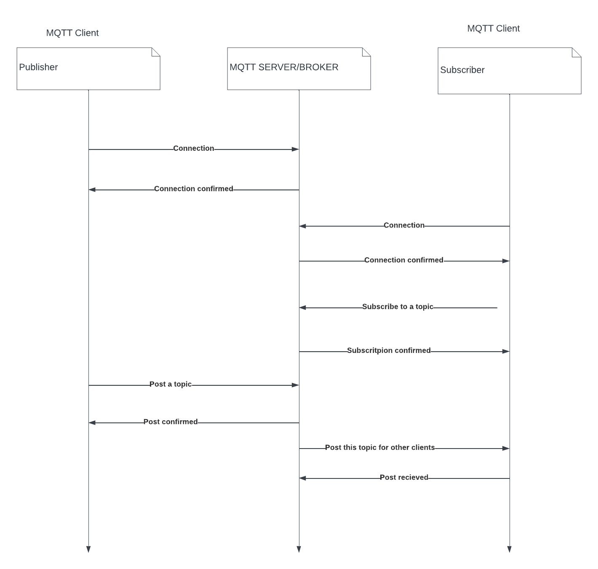

# DP-MQTT-server-implementation-in-Python

## Overview


The actions which are used in the MQTT protocol are publishing and subscribing of messages. It is the main core of the our broker. Server is responsible for receiving messages from IoT devices and sending them back to the message subscribers. The system we gonna build gonna inherit Netty's easy-to-use, simple, high-performative and safe features, as well as fast development.
We are going to provide real-time and reliable messaging by our service to other devices, while only trying to minimise code and bandwidth. It is suitable for devices with limited hardware resources and the network environment with limited bandwidth.

Publish / Subscribe model communication between broker and one or more clients where a message **published** to a certain _topic_ will be delivered to every client that is **subscribed** to that _topic_

## Requirements

Install MQTT client library for Python.
This code provides a class that gives access to connect to the mqtt broker to publish messages and to subscribe to topics and receive published messages.
To prepare and use this in Python environment, install the Paho MQTT client. To do so, use the Python package tool. Check out this reference for more information.

```
pip install paho-mqtt
```

## Implementation

We chose _python_  as our primary language, because it provides and gives us access to a lot of excellent MQTT client libraries to implement, as we wanted to use **paho** module. These clients allow us to develop an MQTT client application with very little code.


The goals we gonna try to achieve by implemeting in Pythons are: 

1. One machine will act as a MQTT broker in a network, where all machines are connected to. 

2. We plan to analyse the received topic and extract the device, device command, and command value .

3. Check if the command is valid and execute that command, and after that update the status and send a response to other clients.

## Architecture

python, paho



## Design Patterns

**Adapter** - We want to make messages going through incompatible interfaces with one another.
**Observer** - As subriber, we will be watching over incoming messages to catch them and check.
**Factory Method** - Building main interfaces, handler and client will be created by Factory Method Pattern./n
Using proper design patterns, will allow us to create MQTT server faster, by easily writing code.
